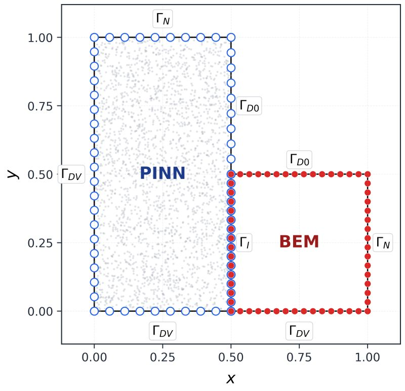

Hybrid Boundary Element–Physics-Informed Neural Network Framework for the Laplace Equation. [[Github](https://github.com/ShayanDodge/Hybrid-BEM-PINN-Electromagnetics/tree/main/Homogeneous%20L-Shaped%20Domain%20(V1.0.0))]

We are pleased to announce the release of the GitHub repository for Version v1.0.0 of the Hybrid BEM-PINN project.

💡 What makes this approach interesting?

It’s based on a 𝗱𝗼𝗺𝗮𝗶𝗻 𝗱𝗲𝗰𝗼𝗺𝗽𝗼𝘀𝗶𝘁𝗶𝗼𝗻 𝘀𝘁𝗿𝗮𝘁𝗲𝗴𝘆:

Instead of choosing between:
• traditional numerical methods
• or neural networks

We combine both — each where it works best:

🔵 Physics-Informed Neural Networks (𝗣𝗜𝗡𝗡) → learn the solution in the most relevant regions of the domain
🔴 Boundary Element Method (𝗕𝗘𝗠) → focuses on boundary interactions, avoiding full-domain computation in less critical regions

This implementation reproduces and extends the methodology presented in:

  Barmada, Dodge et al., *A Novel Hybrid Boundary Element—Physics Informed Neural Network Method for Numerical Solutions in Electromagnetics*,
  IEEE ACCESS, 2024. [[Link](https://ieeexplore.ieee.org/abstract/document/10755077)]

🔜 More advanced versions (complex geometries, improved coupling) are coming soon.

